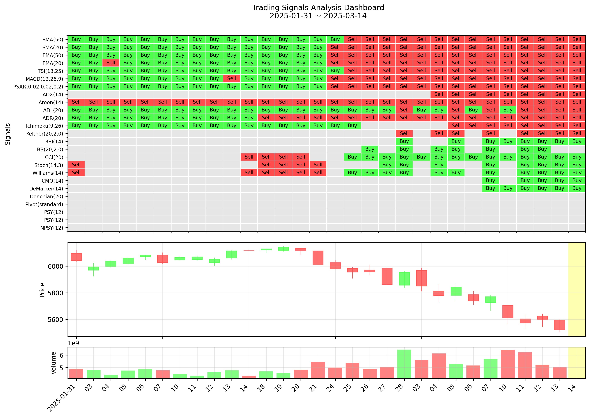

# Technical Indicator Lamp



> **참고**: 위 이미지는 GitHub Actions를 통해 자동으로 생성 및 업데이트되는 트레이딩 시그널 분석 대시보드입니다.

## 프로젝트 개요

Technical Indicator Lamp는 다양한 기술적 지표를 활용하여 트레이딩 시그널을 생성하고 시각화하는 파이썬 기반 프로젝트입니다. 이 프로젝트는 모멘텀 지표와 반추세 지표를 포함한 다양한 기술적 지표를 계산하고, 이를 기반으로 매수/매도 신호를 생성하여 직관적인 히트맵 형태로 시각화합니다.

## 주요 기능

- **다양한 기술적 지표 계산**: SMA, EMA, MACD, RSI, 볼린저 밴드 등 20개 이상의 기술적 지표 계산
- **트레이딩 시그널 생성**: 각 기술적 지표에 기반한 매수/매도 신호 생성
- **시각적 대시보드**: 히트맵과 가격 차트를 결합한 직관적인 시각화 제공
- **거래일 기반 분석**: 실제 거래일을 기준으로 데이터 처리 및 분석
- **자동화된 분석**: GitHub Actions를 통한 자동 데이터 업데이트 및 시각화

## 프로젝트 구조

```
.
├─data
│  ├─processed        # 처리된 데이터 파일 (지표, 시그널, 히트맵)
│  └─raw              # 원본 OHLCV 데이터 파일
├─src                 # 소스 코드
│  ├─config.py        # 설정 파일
│  ├─main.py          # 메인 실행 파일
│  ├─signal_generator.py  # 시그널 생성 모듈
│  ├─technical_indicator.py  # 기술적 지표 계산 모듈
│  └─visualizer.py    # 시각화 모듈
└─tests               # 테스트 코드
```

## 주요 모듈

### 1. 기술적 지표 계산 (`technical_indicator.py`)

`TechnicalIndicator` 클래스는 다양한 기술적 지표를 계산합니다:

- **모멘텀 지표**:
  - SMA (단순이동평균)
  - EMA (지수이동평균)
  - TSI (True Strength Index)
  - MACD (Moving Average Convergence Divergence)
  - PSAR (Parabolic SAR)
  - ADX (Average Directional Index)
  - Aroon
  - ADL (Accumulation Distribution Line)
  - ADR (Average Daily Range)
  - Ichimoku Cloud
  - Keltner Channel

- **반추세 지표**:
  - RSI (Relative Strength Index)
  - BB (Bollinger Bands)
  - CCI (Commodity Channel Index)
  - Stoch (Stochastic Oscillator)
  - Williams %R
  - CMO (Chande Momentum Oscillator)
  - DeMarker
  - Donchian Channel
  - Pivot Points
  - PSY (Psychological Line)
  - NPSY (Negative Psychological Line)

### 2. 시그널 생성 (`signal_generator.py`)

`SignalGenerator` 클래스는 계산된 기술적 지표를 기반으로 트레이딩 시그널을 생성합니다:

- 모멘텀 기반 신호 (추세 추종)
- 반추세 기반 신호 (과매수/과매도)
- 각 지표별 매수/매도/중립 신호 생성

### 3. 시각화 (`visualizer.py`)

`TradingVisualizer` 클래스는 생성된 시그널을 히트맵으로 시각화합니다:

- 히트맵으로 각 지표별 매수/매도 신호 표시
- 캔들차트와 거래량 차트 결합
- 직관적인 시각적 분석 제공

### 4. 설정 관리 (`config.py`)

프로젝트의 주요 설정을 관리합니다:

- 파일 경로 설정
- 기술적 지표 파라미터
- 시그널 임계값
- 시각화 설정

## 설치 방법

1. 저장소 클론:
```bash
git clone https://github.com/yourusername/technical-indicator-lamp.git
cd technical-indicator-lamp
```

2. 필요한 패키지 설치:
```bash
pip install pandas numpy matplotlib mplfinance
```

## 사용 방법

1. 데이터 준비:
   - `data/raw` 디렉토리에 OHLCV 형식의 CSV 파일 준비
   - 파일 형식: Date, Open, High, Low, Close, Volume 컬럼 포함

2. 메인 스크립트 실행:
```bash
python src/main.py
```

## GitHub Actions 자동화

이 프로젝트는 GitHub Actions를 통해 다음과 같은 자동화 기능을 제공합니다:

- 일일 데이터 업데이트
- 기술적 지표 자동 계산
- 시그널 자동 생성
- 대시보드 자동 시각화 및 저장

자동화된 분석 결과는 `data/processed` 디렉토리에 저장되며, README.md의 대시보드 이미지는 자동으로 업데이트됩니다.

## 시그널 해석 방법

- **녹색 셀(Buy)**: 매수 신호
- **빨간색 셀(Sell)**: 매도 신호
- **회색 셀(Neu)**: 중립 신호
- **빈 셀**: 신호 없음

## 라이선스

이 프로젝트는 MIT 라이선스 하에 배포됩니다.

## 기여자

- [Your Name](https://github.com/yourusername)

## 참고 문헌

- Technical Analysis of the Financial Markets - John J. Murphy
- Technical Indicators and Trading Strategies - Tushar Chande 