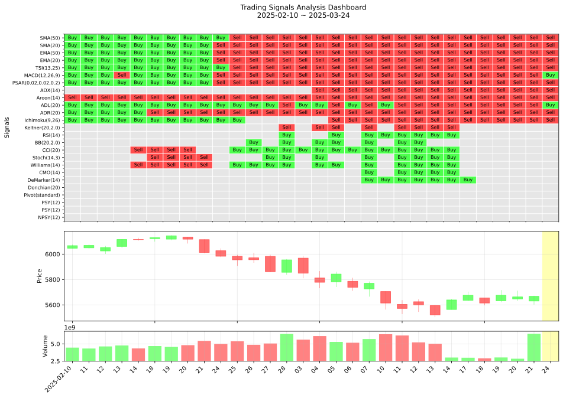

# Technical Analysis Dashboard



> **참고**: 위 이미지는 GitHub Actions를 통해 자동으로 생성 및 업데이트되는 트레이딩 시그널 분석 대시보드입니다.

## 프로젝트 개요

Technical Analysis Dashboard는 S&P 500 ETF(SPY)의 기술적 지표를 분석하고 트레이딩 시그널을 생성하여 시각화하는 파이썬 기반 프로젝트입니다. 이 프로젝트는 모멘텀 지표와 반추세 지표를 포함한 다양한 기술적 지표를 계산하고, 이를 기반으로 매수/매도 신호를 생성하여 직관적인 대시보드 형태로 시각화합니다.

## 주요 기능

- **실시간 데이터 수집**: yfinance를 통한 S&P 500 ETF(SPY) 데이터 자동 수집
- **다양한 기술적 지표 계산**: SMA, EMA, MACD, RSI, 볼린저 밴드 등 20개 이상의 기술적 지표 계산
- **트레이딩 시그널 생성**: 각 기술적 지표에 기반한 매수/매도 신호 생성
- **시각적 대시보드**: 히트맵, 캔들차트, 거래량 차트를 결합한 직관적인 시각화 제공
- **자동화된 분석**: GitHub Actions를 통한 일일 데이터 업데이트 및 시각화

## 프로젝트 구조

```
.
├─data
│  └─raw             # 원본 데이터 파일 (SPY OHLCV)
├─logs               # 로그 파일
├─output             # 결과물 저장 디렉토리
│  ├─indicators.csv  # 계산된 기술적 지표
│  ├─signals.csv     # 생성된 매매 신호
│  ├─dashboard.svg   # 대시보드 (SVG)
│  └─dashboard.png   # 대시보드 (PNG)
├─src                # 소스 코드
│  ├─config/         # 설정 파일
│  │  └─settings.py  # 전역 설정
│  ├─data/           # 데이터 처리
│  │  └─raw/         # 원본 데이터 처리
│  │      └─spy.py   # SPY 데이터 수집
│  ├─indicators/     # 기술적 지표
│  │  └─technical_indicator.py
│  ├─signals/        # 매매 신호
│  │  └─signal_generator.py
│  └─visualization/  # 시각화
│      └─visualizer.py
├─tests              # 테스트 코드
├─main.py            # 메인 실행 파일
└─requirements.txt   # 의존성 목록
```

## 주요 모듈

### 1. 데이터 수집 (`src/data/raw/spy.py`)

`update_spy_data` 함수는 yfinance를 사용하여 S&P 500 ETF(SPY)의 OHLCV 데이터를 수집합니다:
- 최근 7일간의 데이터 자동 수집
- 기존 데이터와 병합하여 중복 제거
- 거래일 기준 데이터 정렬

### 2. 기술적 지표 계산 (`src/indicators/technical_indicator.py`)

`TechnicalIndicator` 클래스는 다양한 기술적 지표를 계산합니다:

- **모멘텀 지표**:
  - SMA (단순이동평균)
  - EMA (지수이동평균)
  - TSI (True Strength Index)
  - MACD (Moving Average Convergence Divergence)
  - PSAR (Parabolic SAR)
  - ADX (Average Directional Index)
  - Aroon
  - ADL (Accumulation Distribution Line)
  - ADR (Average Daily Range)
  - Ichimoku Cloud
  - Keltner Channel

- **반추세 지표**:
  - RSI (Relative Strength Index)
  - BB (Bollinger Bands)
  - CCI (Commodity Channel Index)
  - Stoch (Stochastic Oscillator)
  - Williams %R
  - CMO (Chande Momentum Oscillator)
  - DeMarker
  - Donchian Channel
  - Pivot Points
  - PSY (Psychological Line)
  - NPSY (Negative Psychological Line)

### 3. 시그널 생성 (`src/signals/signal_generator.py`)

`SignalGenerator` 클래스는 계산된 기술적 지표를 기반으로 트레이딩 시그널을 생성합니다:
- 모멘텀 기반 신호 (추세 추종)
- 반추세 기반 신호 (과매수/과매도)
- 각 지표별 매수/매도/중립 신호 생성

### 4. 시각화 (`src/visualization/visualizer.py`)

`TradingVisualizer` 클래스는 생성된 시그널을 대시보드로 시각화합니다:
- 히트맵으로 각 지표별 매수/매도 신호 표시
- 캔들차트와 거래량 차트 결합
- SVG와 PNG 형식으로 저장

## 설치 방법

1. 저장소 클론:
```bash
git clone https://github.com/yourusername/technical-analysis-dashboard.git
cd technical-analysis-dashboard
```

2. 가상환경 생성 및 활성화:
```bash
python -m venv venv
source venv/bin/activate  # Linux/Mac
venv\Scripts\activate     # Windows
```

3. 필요한 패키지 설치:
```bash
pip install -r requirements.txt
```

## 사용 방법

1. 메인 스크립트 실행:
```bash
python main.py
```

실행하면 다음 작업이 순차적으로 수행됩니다:
1. SPY 데이터 업데이트
2. 기술적 지표 계산
3. 매매 신호 생성
4. 대시보드 시각화

## GitHub Actions 자동화

이 프로젝트는 GitHub Actions를 통해 다음과 같은 자동화 기능을 제공합니다:

- 일일 데이터 업데이트 (UTC 21:30)
- 기술적 지표 자동 계산
- 시그널 자동 생성
- 대시보드 자동 시각화 및 저장

자동화된 분석 결과는 `output/` 디렉토리에 저장되며, README.md의 대시보드 이미지는 자동으로 업데이트됩니다.

## 시그널 해석 방법

- **녹색 셀(Buy)**: 매수 신호
- **빨간색 셀(Sell)**: 매도 신호
- **회색 셀(Neu)**: 중립 신호
- **빈 셀**: 신호 없음

## 라이선스

이 프로젝트는 MIT 라이선스 하에 배포됩니다.

## 기여자

- [Your Name](https://github.com/yourusername)

## 참고 문헌

- Technical Analysis of the Financial Markets - John J. Murphy
- Technical Indicators and Trading Strategies - Tushar Chande 